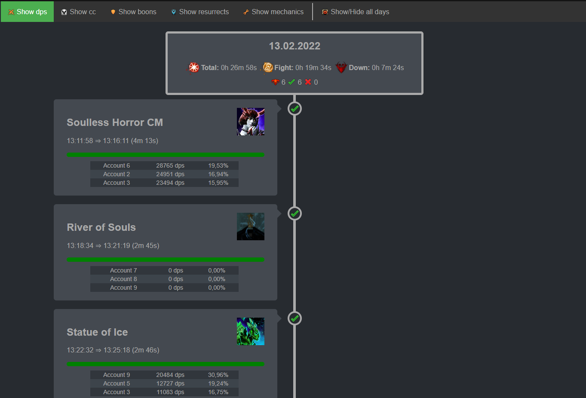

# Raid Timeline

Ever wanted to to see an overview of the raid you just ran?  
Interested in displaying your Elite Insight logs in a nice and beautiful way?  
Need some tools to parse / upload you log files?

This might be for you:



An example timeline can also be found in the `media` folder.

## RaidTimeline.App (rta) 🤖

```
Usage: rta [command]

rta

Commands:
  open      Opens the current timeline file.
  parse     Commands for parsing log files.
  clean     Commands to clean log file folders and free up space.
  size      Commands to show the disk space taken by logs.
  upload    Commands for uploading html and log files.
```

### Features

* Parse arcdps and Elite Insights files into a timeline of your raid
* Use either a local Elite Insights or dps.report as a parser for arcdps logs
* Upload logs to dps.report and get the links back for easy copy & paste action 😉
* Parse new logs "live" as they are written by arcdps (only works with local EI at the moment)
* Upload logs to a "generic" REST endpoint (currently built to support the one my guild uses)
* Show the disk usage of the arcdps and EI logs
* Delete / Clean logs from disk

### Installation

1. Download the latest version from releases
2. Unpack the zip file
3. Open the config.json and enter the options you need (see Configuration)
4. Run `rta.exe` via command line (you can put it in you `PATH` variable for easy access)

### Configuration

```json
{
  // Options needed to parse locally
  "eiPath": "",
  "configurationPath": "",
  
  // Options needed to interact with dps.report
  "dpsReportToken": "",
  "outputPath": "",
  "logPath": "",
  
  // Boss encounter ids filter (same ids as the arcdps.ini uses)
  "bossEncounterIdFilter": "0x3C4E,0x3C45,0x3C0F,0x3EFB,0x3ED8,0x3F09,0x3EFD,0x3EF3,0x3F71,0x3F6B,0x3F76,0x3F9E,0x432A,0x4314,0x4324,0x4302,0xABC6,0x5271,0x5261,0x5231,0x55CC,0x55F6,0x55F0,0x4BFA,0x4CEB,0x4C50,0x4D37,0x4D74",

  // Endpoint upload 
  "endpointUri": "",
  "endpointKey": "",
  "endpointIv": "",
}
```

#### Local parsing with Elite Insights

* `eiPath`: the path to the Elite Insights `.exe` file
* `configurationPath`: the path to the configuration file Elite Insights uses to store your settings

By using the local parsing the folder which is used by arcdps to save the logs and the folder that Elite 
Insights uses to store the html files is taken from the Elite Insights configuration.

#### dps.report settings

* `dpsReportToken`: the user token you have for dps.report. You can find out yours by opening https://dps.report/getUserToken
* `outputPath`: the path that you want the html timeline file to be saved to. Only needed when you do not use Elite Insights.
* `logPath`: the path where arcdps saves the log files. Normally something like `C:\Users\<user>\Dokumente\Guild Wars 2\addons\arcdps\arcdps.cbtlogs`. Only needed when you do not use Elite Insights.

#### Encounter filter

* `bossEncounterIdFilter`: the hexadecimal values of enemies you want to filter for. The default value is all raid bosses. A list of ids can be found on the GW2 wiki: https://wiki.guildwars2.com/wiki/User:Jowjowjow/npcids

#### Generic upload

* `endpointUri`: the uir that is used for uploading html files.
* `endpointKey`: key of the RijndaelManaged encryption in Base64.
* `endpointIv`: key of the RijndaelManaged encryption in Base64.

### Some information

#### How is the timeline created

The timeline takes the created Elite Insight HTML files and creates an overview page where you can:

* See how long your raids (ordered by days) took and how long you where in and out of combat
* See how many bosses you tried / killed / failed
* See the order of your tries and their status
* See the top dps, rez, mechanic fails and the boon uptime
* Click on the try to go to the log

This is done by parsing the HTML files and combining the information from the log files.

#### dps.report upload

Please use the dps.report upload with care and do not spam it with all logs that you have. 
It will upload multiple logs in parallel but is limited to 3 at the same time.

## Information for developers

### Generic endpoint upload

The generic endpoint is built against the REST API that my guild has, so it will not fit to all APIs.
Some information around that:

* The files are encrypted by a RijndaelManaged encryption before the upload and need to be decrypted by the receiver.
* The endpoint for upload is `<endpointUri from the config.json>/<raidGroup>/<date as dd.MM.yyyy>/<filename of the log>` and uses a `http put`. The file is in the `content`of the http request.
* After all files are uploaded  `<endpointUri from the config.json>/<raidGroup>/<date as dd.MM.yyyy>` will be called with `http post` (this triggers the timeline creation on our the server)

### raidTimeline.Logic.dll

Feel free to use the `raidTimeline.Logic.dll`, it provides an interface `ITimelineCreator` and the `TimelineCreator`.  
With these you can build your own tools if you want.

## Special thanks / Mentions

* To the whole [Elite Insights](https://github.com/baaron4/GW2-Elite-Insights-Parser) team, you provide a great product. Keep on coding 👍  
* To [dps.report](https://dps.report) for their great API  
* To the [Guild Wars 2 Wiki](https://wiki-de.guildwars2.com/wiki/Hauptseite), which as great icons 😜
* To the [Cocona](https://github.com/mayuki/Cocona) project with allows for nice command line tools

## Contact

Best via this GitHub Page: https://github.com/danifischer/raidTimeline

Just open an issue if you want a feature or find a bug.


