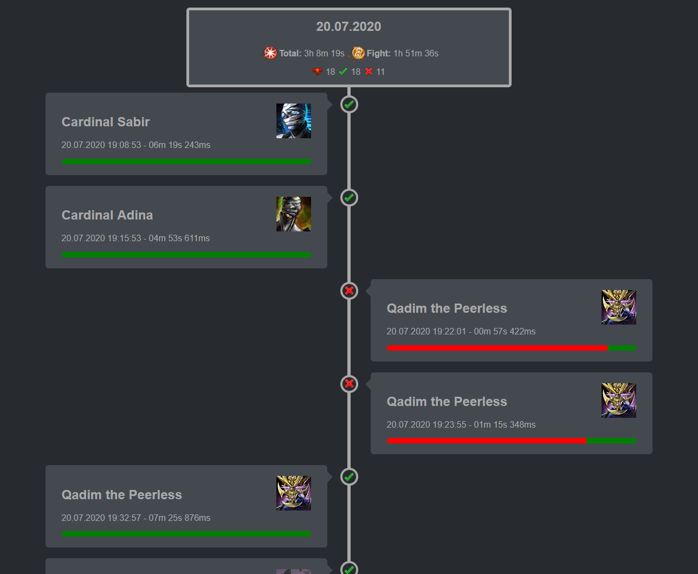

## Contact

Best via this GitHub Page: https://github.com/danifischer/raidTimeline

## Example

You can download the repository and look in the `example` folder ot go [here](http://fischer87.de/logs/raidTimeline/raid.html).

# Raid Timeline

Ever wanted to to see an overiew of the raid you just ran? Interested in displaying your Elite Insight logs in a nice and beautiful way?  
This might be for you:



## Usage for end users

This is a command line application, to use it you need to call it with the path where your Elite Insights HTML files are.

```
raidTimeline.exe [path]
```

For example:

```
raidTimeline.exe "C:\logFolder"
```

As a output a `raid.html` file will be created in the log folder and opened automatically.

## Usage for developers

Feel free to use the `raidTimelineLogic.dll`, it provides an interface `ITimelineCreator` and the `TimelineCreator`.  
To trigger the creation use the `CreateTimelineFile` method, which need the path of the log files and the name of the output file.

## How does this work?

The "Raid Timeline" takes the created [Elite Insight](https://github.com/baaron4/GW2-Elite-Insights-Parser) HTML files and creates an overview page where you can:

- See how long your raids (ordered by days) took and how long you where in combat
- See how many bosses you tried / killed / failed
- See the order of your tries and their status
- Click on the try to go to the log

This is done by parsing the HTML files and combining the information from the log files.

## Special thanks / Mentions

To the whole Elite Insights team, you provide a great product. Keep on coding ;)  
To the Guild Wars 2 Wiki, which as great icons :D

